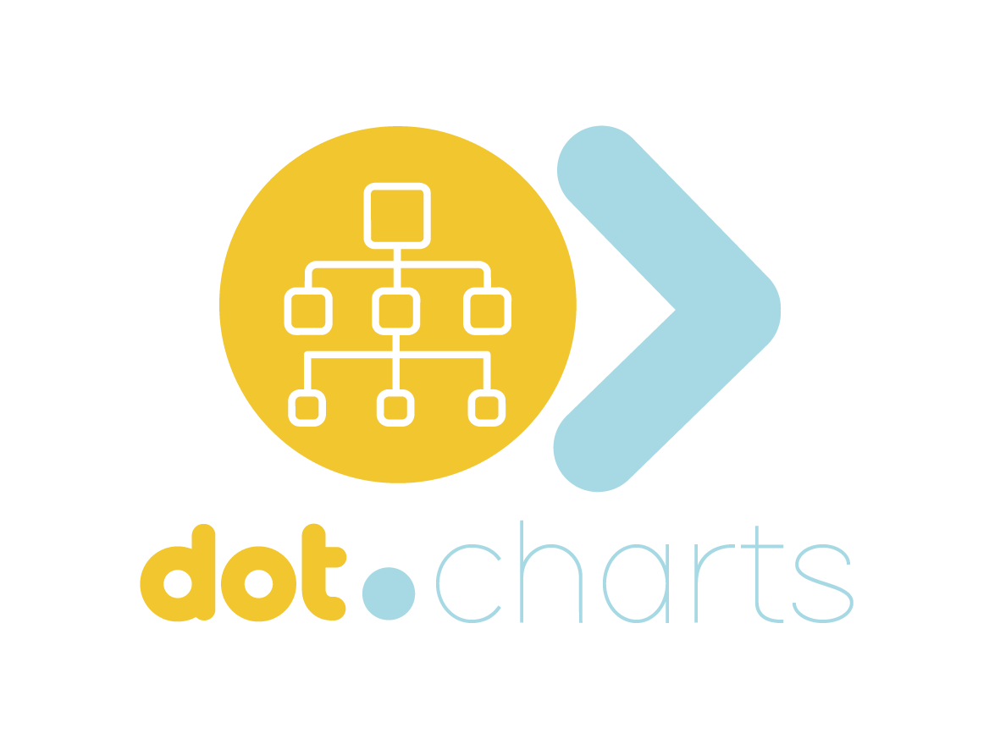

<div align="center">



# Dot.Charts 📊

</div>

**AI-assisted market-analysis platform.** Part of the Dot Ecosystem; registered there as `dot-charts` — as of 2026-08-10 the GitHub repo is named `Dot.Charts` too, matching the registry ID (see [wiki.md](wiki.md) §6, previously `ChartSense`).

> This README is the short front door. For full architecture, honest gap analysis, and the change log, see [wiki.md](wiki.md) — currently at v0.3.1.

---

## What this actually is right now

A working product, not a prototype: a Laravel 12 API, a Python (FastAPI) analytics/backtesting engine, and a Vite frontend with seven wired pages, covered by 198 backend + 83 Python tests (all passing as of the last wiki review).

- **Auth is real.** Sanctum-based register/login/logout/me, with rate limiting on `/register` (5/hour per IP) and `/login` (5/min by email+IP).
- **Backtesting is real.** `POST /api/backtests` runs one of six strategies — MA crossover, RSI mean-reversion, breakout, Bollinger mean-reversion, a custom rule engine, and the 714 Method (an SMC/ICT-style institutional-structure strategy) — against live-fetched OHLCV data (`yfinance` for equity/commodity/forex, `ccxt` for crypto), persisted per user, with pagination/filtering, detail, and delete. Every result carries a `disclosure` object (confidence band, attribution, risk text, drawdown) — never presented as a real signal without that context.
- **There's a visual strategy builder.** Save/load custom rule-based strategies (`strategy-builder.html`), validated server-side by the same rule evaluator that runs them at backtest time.
- **Chart analysis is real when it can be.** `POST /api/chart/analyze` OCRs an uploaded chart for a ticker, then calls the analytics service for genuine swing-structure analysis when a symbol is known. It only falls back to the old hardcoded placeholder (still clearly labeled `is_demo: true`) when no symbol is known or the analytics call fails.
- **There's a trading journal.** Title/body reflections, optionally linked to a backtest run or saved strategy — deliberately never a trade log. No entry/exit price, position size, or P&L field exists anywhere in the schema, and an automated test (`JournalEntriesSchemaInvariantTest`) fails the build if one ever appears.
- **Knowledge Pack publishing to Dot.Brain exists, up to the part that isn't Dot.Charts's to build.** Generate → operator-approve (Ed25519-signed) → retrieve is real and tested, with an inbound *and* outbound compliance/MNPI gate. A `DkpBrainClient` implements Dot.Brain's documented `POST /v1/dkp` contract and is proven schema-conformant against Dot.Brain's real spec — but Dot.Brain itself has no deployed endpoint anywhere in the ecosystem yet, so nothing actually gets sent over the wire today.

Do not treat any output from this app as real trading, investment, or financial advice.

---

## Project structure

```
Dot.Charts/
├── backend/          # Laravel 12 API — 6 controllers (Auth, Backtest, CustomStrategy,
│                      # ChartAnalysis, KnowledgePack, JournalEntry), ~25 routes
├── analytics/         # FastAPI service — real backtesting/chart-analysis engine (Python)
├── frontend/          # Vite, plain HTML/CSS/JS — index, register, login, backtest,
│                      # history, strategy-builder, journal
└── docs/              # design specs + implementation plans per subsystem
```

See [wiki.md §2](wiki.md#2-architecture-built) for the full file-by-file breakdown.

---

## Running it locally

### Backend (Laravel)
```bash
cd backend
composer install
cp .env.example .env
php artisan key:generate
php artisan migrate
php artisan serve
```
Runs at `http://localhost:8000`.

### Analytics service (Python / FastAPI)
```bash
cd analytics
pip install -r requirements.txt
uvicorn main:app --reload --port 8001
```
Runs at `http://localhost:8001`. The backend expects it at `ANALYTICS_SERVICE_URL` (defaults to `http://localhost:8001` — see `backend/.env.example`); backtests and real chart analysis won't work without it running.

### Frontend (Vite)
```bash
cd frontend
npm install
npm run dev
```
Runs at `http://localhost:3000` and calls the backend directly (no dev proxy configured).

### Tests
```bash
cd backend && php artisan test    # 198 tests
cd analytics && pytest            # 83 tests
```

---

## Known gaps (see wiki.md for the full, current list)

- Market data is free-tier, best-effort (`yfinance`/`ccxt`) — no paid vendor, no uptime SLA.
- Knowledge Pack publishing stops at this platform's own API — Dot.Brain has no deployed endpoint to send to yet (ecosystem-level blocker, not Dot.Charts's).
- No watchlist/instrument-identity model yet.
- Position/order tracking is out of scope, always — by design, per the ecosystem compliance posture (see [wiki.md §7](wiki.md#7-compliance-posture)).

---

## License

MIT License — see [LICENSE](LICENSE).
