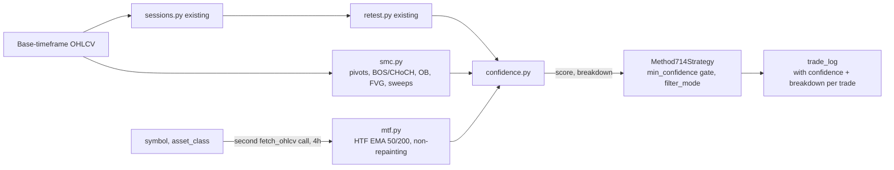

# 714 Method SMC Engine + Confidence Scoring — Design

## Purpose

The original 714 Method slice explicitly deferred two pieces described in
its own source Pine Script (`ORD Session Strategy v3.5`, MPL-2.0, ©
Quant/Infodot): the Smart Money Concepts (SMC) engine — swing-pivot Break
of Structure/Change of Character, order blocks, fair value gaps, and
liquidity sweeps — and the weighted 0–100 confidence score that combines
every filter (including SMC) into one explainable number. This slice
builds both, at full parity with the Pine source, including multi-
timeframe (MTF) confirmation.

**Related documents:**
- [Real Backtesting Engine — Design](2026-08-08-backtesting-engine-design.md) — where 714 Method's reduced core shipped, with SMC/confidence explicitly deferred
- `analytics/strategies/method_714/` — `sessions.py`, `retest.py`,
  `strategy.py` this slice extends, unchanged in their existing behavior

## Why this slice, why now

This is subsystem D of the nine identified in the platform-wide gap audit
(2026-08-08) — the most-requested deferred feature from the original 714
Method design conversation.

## Scope for this slice

**In scope, at full parity with the Pine source:**
- Swing pivots (5-bar pivot high/low, matching `pivLen=5`)
- Break of Structure (BOS) / Change of Character (CHoCH) — a running
  `structureDir` flips on a close crossing the last swing high (bullish
  break) or swing low (bearish break); CHoCH is a break against the prior
  structure direction, BOS is a break with it
- Order blocks: the last down-candle before a bullish break (bullish OB),
  the last up-candle before a bearish break (bearish OB) — kept as a
  bounded rolling list (`obMaxCount=6`, matching the source)
- Fair value gaps: a 3-bar gap where `low > high[2]` (bullish) or
  `high < low[2]` (bearish), with a minimum size of `0.25 × ATR`
  (`fvgMinAtr`), bounded rolling list (`fvgMaxCount=8`)
- Liquidity sweeps: swing-based (wick through the last swing high/low,
  close back inside) and previous-day-high/low sweeps, both with a
  10-bar "recent" memory window matching the source
- Multi-timeframe (4h) EMA 50/200 trend confirmation — a second
  `fetch_ohlcv` call per backtest, resampled/aligned to the base
  timeframe's index, non-repainting (only fully-closed HTF bars are used)
- Full 10-component confidence score: session-signal base (30), trend
  (15), MTF (15), ATR/volatility (15), volume (10), structure (10), sweep
  (5), PA candle quality (10), close-location-value/CLV (5), previous-day
  sweep (5) — raw sum 120, capped at 100 via `min(score, 100)`, exactly
  matching the source's own weighting and cap
- Extension band as a **hard gate** (not a scored component, matching the
  source's own "(hard gate)" label): `|close − open|` must be between
  `0.10 × ATR` and `3.00 × ATR` to avoid trading no-conviction or
  already-exhausted moves — enforced in both filter modes
- Two filter modes, matching the source: `"confidence_only"` (default —
  filters shape the score but never veto alone) and `"hard_filters"`
  (trend + ATR + MTF + volume must all pass in addition to the score)
- `min_confidence` threshold (default 45, matching the source)
- Confidence output is a breakdown object (which components fired and
  their point contribution), not just the final number — explainability
  is a stated requirement, not a nice-to-have

**Explicitly out of scope:**
- Any change to `sessions.py`/`retest.py`'s existing behavior — this
  slice adds detectors and a score on top, it does not modify the
  session/retest signal logic itself
- Backtesting the SMC/confidence layer on MA Crossover or RSI
  Mean-Reversion — this is 714-Method-specific, matching the source
- A UI for visualizing order blocks/FVGs/sweeps on a chart — the design
  audit's "confidence must be explainable" requirement is satisfied by
  returning the breakdown in the API response; a visual chart overlay is
  a separate, larger frontend slice
- Live/streaming SMC detection — this remains a backtest-time computation
  over historical data, same as everything else in the engine

## Architecture

- Three new pure-function modules alongside `sessions.py`/`retest.py`,
  each independently unit-testable against synthetic price series — same
  pattern already established.
- `Method714Strategy.__init__` computes SMC state, MTF trend, and the
  per-bar confidence score/breakdown once (vectorized, same as
  `sessions.py`/`retest.py` today), then `next()` reads the precomputed
  values for the current bar — no change to the strategy's existing
  event-driven bar-by-bar execution model.
- MTF fetch reuses the existing `data.fetch.fetch_ohlcv` function
  unchanged — it already accepts an `interval` parameter; this slice just
  calls it a second time with `interval="4h"`.

## Components & data flow

### `strategies/method_714/smc.py` (new)

- `compute_swing_pivots(df, piv_len=5) -> pd.DataFrame` — adds
  `swing_high`, `swing_low` columns (the pivot price where confirmed, NaN
  elsewhere), confirmed `piv_len` bars after the actual extreme (matching
  `ta.pivothigh`/`pivotlow`'s inherent lag — this is not repainting
  because the confirmation lag is real, not hidden)
- `compute_structure(df_with_pivots) -> pd.DataFrame` — adds
  `structure_dir` (1/-1/0 running state), `bos` and `choch` boolean
  columns
- `compute_order_blocks(df_with_structure, max_count=6) -> list[dict]` —
  each dict: `{type: "bullish"|"bearish", high, low, bar_index}`
- `compute_fair_value_gaps(df, atr, min_atr_mult=0.25, max_count=8) ->
  list[dict]` — each dict: `{type, top, bottom, bar_index}`
- `compute_liquidity_sweeps(df_with_pivots, lookback_bars=10) ->
  pd.DataFrame` — adds `recent_bull_sweep`, `recent_bear_sweep` boolean
  columns (true within `lookback_bars` of a sweep, matching the source's
  "recent memory" pattern)
- `compute_prev_day_sweeps(df, lookback_bars=10) -> pd.DataFrame` — same
  shape, using previous calendar day's high/low

### `strategies/method_714/mtf.py` (new)

- `compute_htf_trend(symbol, asset_class, start_date, end_date, base_index, htf_interval="4h", fast=50, slow=200) -> pd.Series`
  — fetches the HTF dataset, computes EMA 50/200, shifts by one HTF bar
  (non-repainting — the source's own `lookahead_off` equivalent), then
  forward-fills/reindexes onto `base_index` so every base-timeframe bar
  sees the most recently *closed* HTF trend state (`1` bullish, `-1`
  bearish, `0` flat)

### `strategies/method_714/confidence.py` (new)

- `DEFAULT_PARAMS = {"min_confidence": 45, "filter_mode": "confidence_only"}`
- `compute_confidence(signal_dir, row, atr_value, session_range, structure_dir, recent_sweep, htf_trend, ema_fast, ema_slow, use_ema_filter, volume_ok, ...) -> dict`
  returns `{"score": int, "breakdown": {"session": 30, "trend": 15|0, "mtf": 15|0, "atr": 15|0, "volume": 10|0, "structure": 10|0, "sweep": 5|0, "pa_quality": 10|0, "clv": 5|0, "prev_day_sweep": 5|0}}`
  — every component computed independently and summed, capped at 100,
  matching the source's `f_confidence` function component-for-component
- `extension_ok(open_price, close_price, atr_value, min_mult=0.10, max_mult=3.00) -> bool`
  — the separate hard gate, not part of the score

### `strategies/method_714/strategy.py` (modified)

- New params: `min_confidence` (default 45), `filter_mode` (default
  `"confidence_only"`)
- `__init__` additionally computes SMC state, MTF trend series, and a
  per-bar confidence Series (score + breakdown), all vectorized ahead of
  time — same pattern as the existing `_signals`/`_session_starts`
- `next()`: after the existing session/retest signal and trend/ATR/volume
  filters, gate on `extension_ok(...)` (always) and
  `confidence >= min_confidence` (always) and, only when
  `filter_mode == "hard_filters"`, additionally require trend + ATR + MTF
  + volume all pass — mirrors the source's `hardOk`/`finalSignal` logic
- `notify_trade`: attaches the firing bar's `confidence_score` and
  `confidence_breakdown` to the trade record, so `trade_log` (and
  therefore the API response) carries them through
- `metrics.py`'s trade-record shape gains two optional fields:
  `confidence_score`, `confidence_breakdown` — additive, does not change
  MA Crossover/RSI Mean-Reversion's trade records (they never populate
  these fields)

## Error handling

- MTF fetch failure (same `DataFetchError` path as the base fetch): the
  whole backtest fails with the same `422`/error-message pattern already
  in place — no partial/silent degradation to "MTF unavailable, scoring
  without it," since that would silently change what the confidence
  number means from one run to the next.
- Insufficient bars for a 200-period HTF EMA: same pattern as the base
  timeframe's existing EMA(200) guard (built conditionally, only when
  `use_ema_filter`/MTF portions are actually needed) — if MTF data is too
  short, the MTF component of the score is `0` rather than the whole
  backtest failing, since MTF is one of ten components, not a
  precondition for the strategy to run at all.

## Testing

- `smc.py`: one test per detector against a fixed synthetic price
  series — swing pivot confirmation lag, a BOS event, a CHoCH event
  (break against prior structure), one bullish and one bearish order
  block placement, one bullish and one bearish FVG, both sweep types
  (swing-based and previous-day).
- `mtf.py`: HTF EMA alignment onto the base index is non-repainting
  (a base-timeframe bar never sees an HTF bar that hasn't closed yet) —
  constructed as a test where a naive (repainting) implementation would
  produce a different, wrong value.
- `confidence.py`: each of the ten components independently toggles the
  score by its exact documented weight; the cap at 100 is exercised (a
  case where the raw sum would exceed 100); `extension_ok` is verified as
  a hard gate independent of the score.
- `strategy.py`: an integration test where `min_confidence` set above a
  known-achievable score blocks an entry that would otherwise fire, and
  `filter_mode: "hard_filters"` blocks an entry that `"confidence_only"`
  would allow through.
- No live-network calls — MTF fetch is mocked in tests, same pattern as
  the base fetch mocking already established.

## Open questions

None blocking. Noted for later: a chart-level visualization of order
blocks/FVGs/sweeps (explicitly out of scope here) would be a natural
follow-up once the underlying detection exists and is trustworthy.

## Change Log

| Version | Date | Author | Change |
|---|---|---|---|
| 1.0.0 | 2026-08-08 | Charts Platform Lead (brainstorming session) | Initial design: SMC engine (pivots, BOS/CHoCH, order blocks, FVGs, sweeps), MTF confirmation, and the full 10-component confidence score at parity with the Pine source, with an explainable breakdown attached to each trade |
