# Authentication, Rate Limiting & User Ownership — Design

## Purpose

Close the highest-priority gap identified in the platform-wide gap audit
(2026-08-08): anonymous users can currently trigger unlimited real
`yfinance`/`ccxt`-backed backtests with no accountable owner and no cost
control. This slice adds real authentication (Laravel Sanctum),
per-endpoint rate limiting, and populates `backtest_runs.user_id` for real
— the column has existed since the first backtesting slice but was always
null because no auth existed.

This is the first of nine subsystems identified in the audit
(auth/security, market-data caching, backtest history, 714 Method SMC
engine, strategy expansion, strategy builder, chart OCR replacement, forex,
Knowledge Pack publishing). It was picked first because backtest history's
"only your own results" and Knowledge Pack provenance both depend on real
user ownership existing.

**Related documents:**
- [Real Backtesting Engine — Design](2026-08-08-backtesting-engine-design.md) — where `backtest_runs.user_id` was made nullable specifically because no auth existed yet
- [ChartSense's own wiki.md](../../wiki.md) §7 — compliance posture (positions/orders excluded; unrelated to this slice)

## Why this slice, why now

The gap audit found: no Sanctum/Passport/JWT installed, no throttle
middleware on any route, `user_id` nullable everywhere with nothing ever
populating it. This is a real abuse and cost vector — every `/api/backtests`
request triggers a live external API call, and there is currently no limit
on how many an anonymous caller can make.

## Scope for this slice

**In scope:**
- Laravel Sanctum: `POST /api/register`, `POST /api/login`,
  `POST /api/logout`, `GET /api/me`
- Rate limiting: `/api/backtests` at 3/hour (anonymous, per IP) / 30/hour
  (authenticated, per user); `/api/chart/analyze` at 10/hour per IP
  (unauthenticated — matches its current no-auth reality, but the OCR
  shell-out is a real local resource cost worth bounding)
- `BacktestController::store` populates `backtest_runs.user_id` from
  `Auth::user()?->id` when a valid token is presented; stays null for
  anonymous requests (already nullable, no migration needed)
- Anonymous backtests remain allowed (per product decision), just
  rate-limited harder than authenticated ones
- Frontend: `login.html`, `register.html`, a shared auth-state header
  fragment, `backtest.html`/`backtest.js` send `Authorization: Bearer
  <token>` when a token is present in `localStorage`

**Explicitly out of scope:**
- Email verification, password reset — real gaps, deferred to their own
  slice, not silently assumed done
- Forcing login to use the platform at all — anonymous access is a
  deliberate product decision for this slice, not an oversight
- Backtest history UI, per-user filtering of history (next slice; depends
  on this one)
- Any OAuth/social login — email+password only
- Rate limiting on the two existing read-only market-data endpoints
  (`EnhancedMarketDataController`) — out of scope, not part of the
  backtesting/auth surface this slice touches

## Architecture

```mermaid
flowchart LR
    UI[login.html / register.html] -->|POST /api/register, /api/login| AUTH[Sanctum: issue token]
    AUTH -->|token| STORE[localStorage]
    STORE -->|Bearer token, if present| BT[backtest.html]
    BT -->|POST /api/backtests| RL[Throttle middleware\n3/hr anon, 30/hr auth]
    RL --> BC[BacktestController]
    BC -->|user_id = Auth::user snake case id| DB[(backtest_runs)]
```

- Sanctum issues personal access tokens (not SPA cookie auth) — the
  frontend and backend run on different ports/origins in dev and likely
  different domains in production, so bearer tokens are the simpler,
  more portable choice over Sanctum's cookie-based SPA mode.
- Rate limiting uses Laravel's built-in `throttle` middleware with named
  limiters (`RateLimiter::for(...)` in a service provider), keyed by user
  ID when authenticated and by IP when not — standard Laravel pattern, no
  new dependency.
- `BacktestController::store` changes in exactly one place: `'user_id' =>
  $request->user()?->id` already exists in the code (written speculatively
  when auth didn't exist yet); once Sanctum's middleware is on the route,
  `$request->user()` starts returning a real user for authenticated
  requests. No controller logic changes beyond adding the middleware.

## Components & data flow

### Laravel (`backend/`)

- `composer require laravel/sanctum`, publish config, run its migration
  (adds `personal_access_tokens` table — Sanctum's own, not something we
  hand-write).
- `app/Http/Controllers/AuthController.php` (new): `register`, `login`,
  `logout`, `me`. Registration validates unique email, hashes password via
  `Hash::make`. Login checks credentials via `Auth::attempt`-equivalent for
  API (Sanctum's `createToken`).
- `routes/api.php`: add the four auth routes (unauthenticated except
  `logout`/`me`, which require `auth:sanctum`); wrap `/api/backtests` and
  `/api/chart/analyze` in named throttle middleware.
- `app/Providers/AppServiceProvider.php` (or a new
  `RateLimitServiceProvider`): define `RateLimiter::for('backtests', ...)`
  and `RateLimiter::for('chart-analysis', ...)` — the anonymous/
  authenticated split for backtests lives here, keyed by
  `$request->user()?->id ?: $request->ip()`.
- `BacktestController::store`: no change to the `user_id` line (already
  correct); route-level middleware is the only change that makes it start
  working.

### Frontend (`frontend/`)

- `login.html` / `register.html`: matches the existing dark-theme card
  style from `backtest.html`. On success, store the Sanctum token in
  `localStorage` under `chartsense_token`.
- `src/auth.js` (new, shared): `getToken()`, `setToken()`, `clearToken()`,
  `isLoggedIn()`.
- `src/backtest.js`: reads the token via `auth.js` and adds
  `Authorization: Bearer <token>` to the `/api/backtests` fetch call when
  present; omitted entirely when anonymous (backend already accepts both).
- `index.html`/`backtest.html` header: small "Log in" / "Log out
  (email)" link reflecting auth state.

## Error handling

- Registration: `422` on validation failure (duplicate email, weak
  password) with Laravel's standard validation error shape.
- Login: `401` on bad credentials, generic message (no user-enumeration
  hints — "these credentials do not match our records").
- Rate limit exceeded: Laravel's default `429 Too Many Requests` with a
  `Retry-After` header — no custom handling needed, this is built into the
  `throttle` middleware.
- Backtests: unchanged from the existing design — anonymous and
  authenticated requests both flow through the same controller logic,
  only `user_id` differs.

## Testing

- `AuthControllerTest` (Feature): register (success + duplicate email
  rejected), login (success + bad credentials rejected), logout
  (token invalidated), `me` (returns current user when authenticated,
  `401` when not).
- `BacktestControllerTest` (extend existing): a request with a valid
  Sanctum token populates `backtest_runs.user_id`; a request without one
  still succeeds with `user_id` null (regression check — anonymous access
  must keep working).
- Rate-limit tests: exceed the anonymous limit (4th request in the same
  hour from the same IP) → `429`; exceed the authenticated limit (31st
  request) → `429`; confirm the limits are actually different (an
  authenticated user isn't capped at the anonymous ceiling).
- No live-network calls — Sanctum's token creation and Laravel's rate
  limiter are both testable in-process; `Http::fake()` continues to cover
  the analytics-service call as in existing tests.

## Open questions

None blocking. Deferred, flagged for future slices:
- Email verification and password reset are real gaps this slice
  deliberately does not close.
- If backtest volume grows, the rate-limit numbers (3/hr anon, 30/hr auth)
  should be revisited against real usage data — they're reasonable
  starting defaults, not measured.

## Change Log

| Version | Date | Author | Change |
|---|---|---|---|
| 1.0.0 | 2026-08-08 | Charts Platform Lead (brainstorming session) | Initial design: Laravel Sanctum token auth, register/login/logout/me endpoints, per-endpoint rate limiting (anonymous vs authenticated split for backtests), `backtest_runs.user_id` populated for real, frontend login/register pages |
