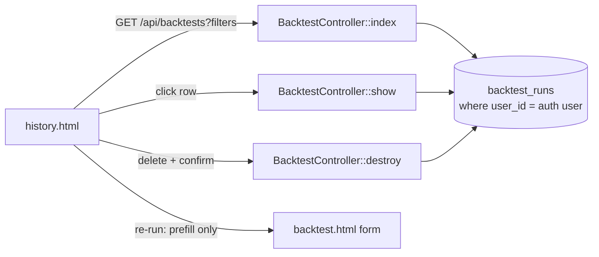

# Backtest History UI — Design

## Purpose

Every backtest has been persisted to `backtest_runs` since the first
backtesting slice, and `user_id` has genuinely worked since the auth slice
— but nothing has ever read that history back. This slice adds the second
subsystem identified in the platform-wide gap audit (2026-08-08): a way
for a logged-in user to browse, filter, inspect, delete, and re-run their
own past backtests.

**Related documents:**
- [Real Backtesting Engine — Design](2026-08-08-backtesting-engine-design.md) — `backtest_runs` schema this slice reads
- [Auth, Rate Limiting & User Ownership — Design](2026-08-08-auth-rate-limiting-design.md) — the ownership model this slice depends on

## Why this slice, why now

This was explicitly called out as blocked on auth in the gap audit: "only
your own results" requires real user ownership to exist first. It now
does. This is the natural next slice.

## Scope for this slice

**In scope:**
- `GET /api/backtests` — paginated list of the authenticated user's own
  runs, with optional `strategy`, `asset_class`, `status` filters
- `GET /api/backtests/{id}` — full detail of one run; `404` (not `403`) if
  it doesn't belong to the requesting user, so a guessed ID never confirms
  its own existence
- `DELETE /api/backtests/{id}` — same ownership check, actually removes
  the row
- New `history.html`: filter row, paginated list ("Load more" button, not
  numbered pages or infinite scroll), click-through detail view reusing
  `backtest.js`'s existing `renderResult()` rather than a second renderer
- Delete requires an explicit confirm step in the UI
- "Re-run" pre-fills `backtest.html`'s form with the past run's exact
  symbol/asset_class/strategy/params/dates — it does **not** auto-execute,
  so it never silently spends a rate-limit slot on the user's behalf
- History requires login — no exception, no anonymous history view

**Explicitly out of scope:**
- Any view of anonymous (`user_id: null`) runs, by anyone, anywhere
- Editing a past run's params in place (re-run creates a *new* run via the
  normal form flow; it doesn't mutate history)
- Sharing/exporting a run (CSV, PDF, public link) — not requested
- Admin-level "see everyone's history" — this is a personal history view
  only

## Architecture



- All three new endpoints require `auth:sanctum` middleware (a real
  change from `/api/backtests`'s POST route, which intentionally stays
  open to anonymous callers — these three are read/delete operations on
  *existing* personal data, a different trust boundary).
- `BacktestController` gains `index`, `show`, `destroy` methods alongside
  the existing `store`. No new controller class — this is the natural
  home for backtest-run operations.
- Ownership check is identical in `show` and `destroy`:
  `BacktestRun::where('id', $id)->where('user_id', $request->user('sanctum')->id)->firstOrFail()`
  — `firstOrFail()` throws Laravel's standard `ModelNotFoundException`,
  which the framework already renders as `404` for JSON requests, so no
  custom error handling is needed.

## Components & data flow

### Laravel (`backend/`)

- `routes/api.php`: new `auth:sanctum`-protected group:
  ```php
  Route::middleware('auth:sanctum')->group(function () {
      Route::get('/backtests', [BacktestController::class, 'index']);
      Route::get('/backtests/{backtestRun}', [BacktestController::class, 'show']);
      Route::delete('/backtests/{backtestRun}', [BacktestController::class, 'destroy']);
  });
  ```
- `BacktestController::index`: paginates `BacktestRun::where('user_id',
  ...)`, applies `strategy`/`asset_class`/`status` filters when present as
  query params, orders by `created_at desc`.
- `BacktestController::show` / `destroy`: ownership-scoped lookup as
  above.

### Frontend (`frontend/`)

- `history.html`: filter dropdowns (mirroring `backtest.html`'s asset
  class/strategy options), a list container, "Load more" button, and a
  detail panel that becomes visible on row click.
- `src/history.js`: fetches `/api/backtests` with the current filters and
  `page` param; on row click, fetches `/api/backtests/{id}` and calls the
  same `renderResult()` used by `backtest.js` (refactored into a small
  shared module, or duplicated once and consolidated later — decided at
  planning time based on how entangled it is with `backtest.js`'s DOM
  IDs).
- "Re-run": stores the selected run's request params in
  `sessionStorage`, navigates to `backtest.html`, which — if that key is
  present — pre-fills the form fields instead of the current AAPL/2023
  defaults, then clears the key.
- Delete: confirm via a plain `confirm()` dialog (matches this app's
  minimal-JS conventions — no custom modal component exists anywhere
  else in the codebase), then `DELETE /api/backtests/{id}`, then remove
  the row from the list on success.
- Auth-state header link gains a "History" entry next to "Log in"/"Log
  out" on both `backtest.html` and `history.html`.

## Error handling

- `index`: no filters is valid (returns everything, paginated); an
  invalid `strategy`/`asset_class`/`status` filter value is silently
  ignored rather than erroring — a bad or stale filter value shouldn't
  break the list.
- `show`/`destroy` on a non-existent or not-owned ID: `404`, generic
  message, no confirmation the ID exists at all.
- `destroy` on an already-deleted ID (double-click race): `404`, same as
  above — idempotent from the user's perspective (the row is gone either
  way).

## Testing

- Laravel: `index` returns only the authenticated user's runs (seed runs
  for two users, assert isolation); filters narrow results correctly;
  pagination returns the expected page size and a `next` cursor/page
  indicator; unauthenticated request to any of the three routes → `401`.
- Laravel: `show` returns full detail for an owned run; `404` for another
  user's run; `404` for a nonexistent ID.
- Laravel: `destroy` removes an owned run and returns success; `404` for
  another user's run (and the row is verified still present in DB
  afterward — proving the check actually blocked the delete, not just
  responded wrong).
- Frontend: manual verification (matches existing project convention) —
  create a few runs, browse/filter the list, open a detail view, re-run
  one (confirm the form pre-fills but doesn't auto-submit), delete one
  with and without confirming.

## Open questions

None blocking. Noted for later: if history grows large per user, the
"Load more" pagination approach should be revisited for cursor-based
pagination — offset pagination is fine at today's expected scale.

## Change Log

| Version | Date | Author | Change |
|---|---|---|---|
| 1.0.0 | 2026-08-08 | Charts Platform Lead (brainstorming session) | Initial design: GET/DELETE endpoints on backtest_runs scoped to the authenticated owner, history.html with filters + load-more pagination + reused result renderer, confirm-gated delete, pre-fill-only re-run |
