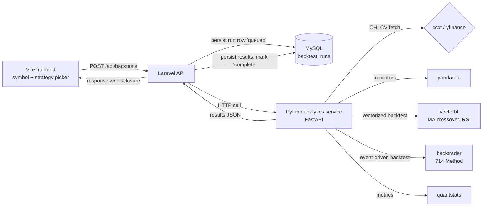

# Real Backtesting Engine — Design

## Purpose

Replace ChartSense's hardcoded/demo signal payload with a real, working backtesting
slice of the platform: users pick a symbol, asset class, and a strategy preset, and get
back an actual backtest run — computed against real historical price data, persisted,
and rendered with the disclosure standards Dot.Charts' compliance posture requires
(confidence band, attribution, loss-honesty). This is the first "real" (non-demo)
analytical output the platform ships.

Source of strategy/library ideas: [paperswithbacktest/awesome-systematic-trading](https://github.com/paperswithbacktest/awesome-systematic-trading)
— used as a curated catalog to select concrete libraries (vectorbt, pandas-ta,
quantstats, yfinance, ccxt) and strategy presets, not pulled in as a dependency or
forked as code. A third preset, "714 Method," is ported from an MPL-2.0-licensed
Pine Script strategy (`ORD Session Strategy v3.5`, © Quant/Infodot) supplied directly
for this design — see §714 Method below for the attribution and scope caveat.

**Related documents:**
- [Dot.Brain's ecosystem view of Dot.Charts](../../../Dot.Brain/platforms/dot-charts.md) — long-term vision, compliance-gate design (not built in this slice)
- [ChartSense's own wiki.md](../../wiki.md) — current platform state, roadmap this slice advances

## Why this slice, why now

ChartSense today: `POST /api/chart/analyze` runs OCR on an uploaded chart image to
detect a ticker, then returns a **fixed placeholder payload** (`signal: Buy`,
`confidence: 85`, hardcoded levels), explicitly labeled `is_demo: true`. Several
backend services (market data, statistical analysis, a basic backtester, signal
feedback) exist but aren't wired into any real pipeline. There is no persistence
beyond `User`, no real backtest history, no disclosure rendering.

This design picks the highest-leverage first slice: a real backtesting engine. It's
the credibility foundation — strategy presets, a trading journal, and eventually
Knowledge Pack publishing to Dot.Brain all assume a working backtest underneath them.

## Scope for this slice

**In scope:**
- New Python analytics microservice for quant computation, with two backtesting
  engines: `vectorbt` (vectorized) and `backtrader` (event-driven)
- Three strategy presets: MA crossover, RSI mean-reversion (both `vectorbt`), and
  714 Method (`backtrader`, reduced core — see §714 Method)
- Crypto (via ccxt/Binance) and equities (via yfinance) as asset classes
- Persisted backtest run history (new `backtest_runs` table)
- Disclosure rendering (confidence band, attribution, loss-honesty) on every result
- New standalone endpoint; existing OCR chart-upload flow (`/api/chart/analyze`) is untouched

**Explicitly out of scope (not silently assumed):**
- Strategy builder UI, trading journal, position/order tracking — permanently out of
  scope for Charts per the wiki (positions/orders are never persisted here)
- Knowledge Pack publishing to Dot.Brain (`observation`/`insight`/`outcome`/`incident`)
- Compliance/MNPI gate (`dot-charts.md` §7) — this slice only consumes public OHLCV
  price data, nothing ecosystem-sourced, so the gate is never invoked here
- The `ChartSense` vs `dot-charts` repo-naming discrepancy — unrelated, unresolved
- Async/queued backtest execution — synchronous request/response for v1
- 714 Method's SMC engine (BOS/CHoCH, order blocks, fair value gaps, liquidity
  sweeps) and weighted confidence scoring — deferred to a follow-up slice, see
  §714 Method

## Architecture



- A new Python service (`analytics/`, FastAPI) is a sibling deploy unit to the Laravel
  backend, called synchronously over HTTP.
- Laravel remains the system of record: owns auth, persistence, request validation,
  and disclosure rendering. The Python service returns raw numeric results only — no
  user-facing text, no opinions, no persistence. Pure computation, stateless.
- Data: `yfinance` (equities), `ccxt`/Binance (crypto) — both free/keyless, consistent
  with the project's existing "no paid vendor yet" posture.
- Two backtesting engines, chosen per strategy: `vectorbt` for the vectorized
  presets (MA crossover, RSI mean-reversion), `backtrader` for the stateful/
  event-driven 714 Method (session arming, retest windows, ratcheting stops don't
  fit a vectorized model). The strategy registry (below) owns this mapping — the
  `POST /api/backtests` contract doesn't change per engine.

## Components & data flow

### Python service (`analytics/`)

`POST /backtest`
```json
{
  "symbol": "AAPL",
  "asset_class": "equity",
  "strategy": "ma_crossover",
  "params": { "fast_window": 20, "slow_window": 50 },
  "start_date": "2023-01-01",
  "end_date": "2026-01-01"
}
```

- Fetches OHLCV via `yfinance` or `ccxt` depending on `asset_class`.
- Computes indicators via `pandas-ta`.
- Runs the strategy through `vectorbt`.
- Derives metrics via `quantstats`: total return, win rate, max drawdown, Sharpe.
- Returns raw JSON: metrics + equity curve series + trade list.
- Strategies live as small, individually testable functions/classes behind a
  registry (`strategies/ma_crossover.py`, `strategies/rsi_mean_reversion.py`,
  `strategies/method_714.py`), keyed by name to an engine (`vectorbt` or
  `backtrader`) so adding a future preset (breakout, Bollinger Bands) is additive.

#### 714 Method (reduced core)

Ported from the supplied Pine Script (`ORD Session Strategy v3.5`, MPL-2.0,
© Quant/Infodot) via `backtrader`, this preset requires intraday OHLCV (1h or
lower) — meaningfully limits equities backtest windows under yfinance's free-tier
history, which the disclosure block surfaces via the existing confidence-band rule
(short sample size → lower confidence, shown not hidden).

Ported for this slice:
- Up to 4 configurable intraday sessions (default times, Africa/Johannesburg
  timezone, adjustable per run)
- Signal modes: Retest Continuation (default), Contrarian, Momentum — session
  close-vs-open sets a directional bias; in Retest Continuation, a pullback that
  touches the session open and closes back on the bias side (within a max-bars
  window, past a minimum rejection size) fires the entry
- Filters: EMA 50/200 trend, ATR range filter, volume confirmation, HTF (4h) EMA
  confirmation
- Risk management: ATR-based stop loss/take profit, breakeven ratchet, optional
  ATR trailing stop, flatten-at-next-session-start, one-trade-at-a-time

Deferred to a follow-up slice (each a substantial sub-system on its own):
- The SMC engine — swing-pivot Break of Structure/Change of Character, order
  blocks, fair value gaps, liquidity sweeps (incl. previous-day high/low sweeps)
- The weighted 0–100 confidence score combining all of the above

**Naming and attribution:** shipped as "714 Method" in the registry and UI. The
disclosure/attribution text explicitly states this is an original session-based
implementation (Blupin/Infodot's ORD Session Strategy) — **not** a verified
reproduction of Mashaya A. Mthethwa's proprietary 714 course material, which was
never obtained or consulted for this design.

### Laravel side

- New `BacktestController` — `POST /api/backtests`:
  1. Validates input.
  2. Creates a `backtest_runs` row, `status: queued`.
  3. Calls the Python service synchronously.
  4. On success: writes `status: complete` + results JSON.
  5. On failure: writes `status: failed` + error, surfaces a clean message (never a
     stack trace) — e.g. bad symbol/no data → `422`, data-vendor timeout → `503`.
- New migration `backtest_runs`: `id, user_id, symbol, asset_class, strategy, params
  (json), start_date, end_date, status, results (json), created_at`.
- New `DisclosureFormatter` service wraps every result with:
  - **Confidence band** — derived from sample size/trade count (few trades → low
    confidence, shown not hidden).
  - **Attribution** — e.g. "MA Crossover, 20/50, backtested Jan 2023–Jan 2026".
  - **Risk disclosure** string.
  - **Loss-honesty** — max drawdown and losing-trade count are required response
    fields, always present alongside win rate; never a cherry-picked headline number.
  - Built as a reusable service (not inline per-endpoint) so future signal-emitting
    endpoints reuse it.

### Frontend

- New page: symbol input, asset-class toggle, strategy dropdown (3 presets), strategy
  params (714 Method's session-time/mode/filter params shown only when selected),
  date range → submit → poll/display run status → render equity curve chart +
  metrics table + disclosure block.
- Existing OCR chart-upload page/flow is untouched.

## Error handling

- Python: bad symbol/no data → `422`; upstream vendor timeout → `503`.
- Laravel: strategy/param validation happens before the Python call (fail fast).
- Failures mark the run `failed` in `backtest_runs`, never silently dropped.

## Testing

- Python: `pytest` unit tests per strategy function (known input series → expected
  trade signals); a golden-file test for MA crossover against a fixed synthetic price
  series. For 714 Method: unit tests on the session engine (session start/end
  detection, bias assignment) and the retest state machine (armed → touched →
  rejected → signal; armed → expired; armed → invalidated) against fixed synthetic
  intraday series, independent of live data. No live-network calls in tests —
  vendor calls are mocked.
- Laravel: PHPUnit feature test hitting `/api/backtests` with the Python service
  mocked (`Http::fake`), asserting persistence + disclosure block shape; a
  `DisclosureFormatter` unit test asserting loss fields are always present.

## Open questions

None blocking this slice. Deferred/flagged for future slices:
- When Knowledge Pack publishing is built, backtest run history (`backtest_runs`) is
  the natural source for `observation`/`outcome` packs to Dot.Brain.
- Async/queued execution should be revisited if backtest runtimes grow beyond a
  synchronous request budget.
- 714 Method's SMC engine (BOS/CHoCH, order blocks, FVGs, liquidity sweeps) and
  weighted confidence scoring are a follow-up slice, not this one.
- If a verified copy of Mashaya Mthethwa's actual 714 course rules is obtained
  later, it should be evaluated against this implementation and the naming/
  attribution language revisited accordingly.

## Change Log

| Version | Date | Author | Change |
|---|---|---|---|
| 1.0.0 | 2026-08-08 | Charts Platform Lead (brainstorming session) | Initial design: Python analytics microservice, vectorbt-based backtesting, MA crossover + RSI mean-reversion presets, crypto + equities via ccxt/yfinance, persisted `backtest_runs`, disclosure rendering |
| 1.1.0 | 2026-08-08 | Charts Platform Lead (brainstorming session) | Added third preset "714 Method" (reduced core: sessions, retest/contrarian/momentum signal, EMA/ATR/volume/HTF filters, ATR risk management), ported from a supplied MPL-2.0 Pine Script (`ORD Session Strategy v3.5`, © Quant/Infodot) via a new `backtrader` engine alongside `vectorbt`; SMC engine and confidence scoring deferred; attribution clarified as an original implementation, not a verified port of Mashaya Mthethwa's proprietary course material |
